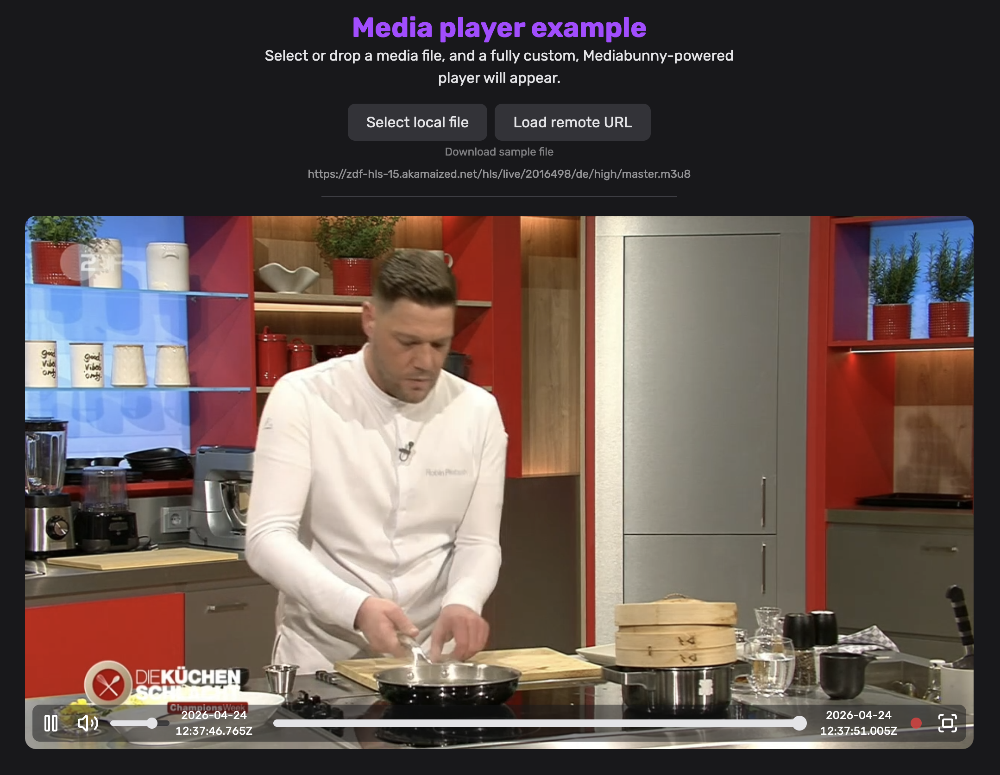

<script setup>
import BlogAuthor from '../components/BlogAuthor.vue';
</script>


<p class="!m-0 opacity-70">{{ $frontmatter.publishedOn }}</p>

<h1>{{ $frontmatter.title }}</h1>

<BlogAuthor />

Mediabunny v1.42.0 adds support for HTTP Live Streaming (HLS). This has been in the making for the last ~4 months and is, by far, the biggest addition to Mediabunny since its original release. Like the rest of Mediabunny, it has been implemented from scratch with zero dependencies and is tiny (adds about ~30 kB of additional bundle size).

If you wanna jump right into detailed guides for reading and writing HLS, check out [Reading HLS](../guide/reading-hls) and [Writing HLS](../guide/writing-hls). For the full release notes, see [v1.42.0](https://github.com/Vanilagy/mediabunny/releases/tag/v1.42.0).

## What is HTTP Live Streaming (HLS)?

For those unfamiliar, HLS is a protocol used to stream media over the internet using HTTP. At its core, it chunks a long piece of media (like a TV episode) into many short segments, each of which is individually addressable via HTTP, and then provides an index called a "playlist" to the user telling them about the available segments. The client then requests whichever segments it needs.

HLS also enables multiple variants and renditions of the same contents. Typically, this means the same video/audio content encoded with multiple bitrates, resolutions and codecs, and multiple audio tracks, one for each language.

## Supported features

One of the reasons that HLS has been in the works for so long is because I've been extremely thorough with the supported feature set.

Mediabunny supports:
- HLS reading **and** writing
- both VOD and live content
- both unencrypted and encrypted content (including DRM-protected content)
- an arbitrary number of video and audio tracks
- any configuration of variant streams and media renditions
- all segment formats (MPEG-TS, CMAF, fMP4, ADTS, MP3, WAV, ...)
- all codecs (H.264, HEVC, AV1, AAC, MP3, WAVE, AC-3, E-AC-3, ...)
- full lazy loading of track metadata and media, minimizing HTTP requests
- logarithmic seeking performance
- single-file segments via #EXT-X-BYTERANGE and HTTP range requests
- track metadata information (language, name, primary track, autoselect, ...)
- full master playlist configuration for writing
- datetime-stamped media data via #EXT-X-PROGRAM-DATE-TIME
- mid-stream discontinuities
- I-frame only video tracks via #EXT-X-I-FRAME-STREAM-INF
- more, probably

Most of the above features are implemented _symmetrically_, meaning they are available for both reading and writing operations.

---

To be fully transparent, these features are not yet supported:
- Subtitles (WebVTT, CEA-608/708, ...)
- ID3v2 metadata extraction
- Writing encrypted segments
- Low-latency HLS
- Built-in analytics, ABR, or CMCD (this is for the user to do)

## Difference to existing solutions like hls.js

The way Mediabunny enables interaction with HLS playlists is fundamentally different from how existing tools such as [hls.js](https://github.com/video-dev/hls.js) (give them a star!) do it. To put it simply, hls.js is to Mediabunny what a `<video>` element is to FFmpeg's C API: one offers a simple, playback-focused developer experience while the other provides fine-grained control over tracks, media samples, decoding, and much more.

Mediabunny is not an HLS player. Mediabunny can be used to build an HLS player, and it can do many things beyond that.

## What can it do?

The API surface added by the HLS update is vast and I obviously can't cover it in this announcement. But, here are just some cool things that Mediabunny now enables:

### Downloading an HLS playlist as an MP4

By using the Conversion API, you can just do this:

<div class="text-xs">

```ts
import { ... } from 'mediabunny';

const input = new Input({
	source: new UrlSource('https://example.com/playlist.m3u8'),
	formats: HLS_FORMATS,
});

const output = new Output({
	format: new Mp4OutputFormat(),
	target: new BufferTarget(),
});

const conversion = await Conversion.init({ input, output });
await conversion.execute();

// Done:
const mp4File = output.target.buffer!;
```

</div>

That's it. This will stream-download the entire HLS playlist, transcode it if necessary using hardware-accelerated decoding and encoding, and bundle it into a single MP4 for the user to download. All of this is fully pipelined, meaning memory usage is bounded ($O(1)$). Speed is usually limited by the client's internet connection.

### Creating an HLS playlist from a client-side video, with multiple renditions

This is basically the inverse of the previous example. Just like we're able to read HLS and turn it into an MP4, we're able to read any input file and turn it into a full HLS playlist including master playlist, media playlists and segments:

<div class="text-xs">

```ts
import { ... } from 'mediabunny';

const input = new Input({
	source: new BlobSource(file), // E.g., a user-selected file
	formats: ALL_FORMATS,
});

// This defines the shape and destination of the output files
const output = new Output({
	format: new HlsOutputFormat({
		segmentFormat: new MpegTsOutputFormat(),
	}),
	target: new PathedTarget(
		'master.m3u8',
		async ({ path }) => new BufferTarget({
			// Upload it directly to a server
			onFinalize: buffer => fetch(`/upload?file=${encodeURIComponent(path)}`, {
				method: 'PUT',
				body: buffer,
			}),
		}),
	),
});

const conversion = await Conversion.init({
	input,
	output,
	// Offer the video in 5 different resolutions:
	video: [
		{ codec: 'avc', height: 1080 },
		{ codec: 'avc', height: 720 },
		{ codec: 'avc', height: 480 },
		{ codec: 'avc', height: 360 },
		{ codec: 'avc', height: 240 },
	],
	// Offer the audio in AAC:
	audio: [
		{ codec: 'aac' },
	],
});
await conversion.execute();
```

</div>

This code creates all renditions as fast as it can, encoding them all in parallel using WebCodecs. By the end, the entire HLS file structure will have been uploaded to the server, fully client-side generated.

No transcode server is needed here, it's all handled by the client, and the server receives a ready-to-stream HLS playlist.

### Live streaming HLS playlists from the client

You could build an OBS-like broadcasting system where a user records their screen, facecam or microphone, encodes multiple variants locally, and then broadcasts finished HLS segments directly to the server, meaning no transcoding is needed.

<div class="text-xs overflow-auto">

```ts
// Get the screen and mic
const displayStream = await navigator.mediaDevices.getDisplayMedia({ video: true });
const micStream = await navigator.mediaDevices.getUserMedia({ audio: true });
const displayTrack = displayStream.getVideoTracks()[0];
const micTrack = micStream.getAudioTracks()[0];

// Define the shape of the output
const output = new Output({
	format: new HlsOutputFormat({
		segmentFormat: new MpegTsOutputFormat(),
		live: true, // Live mode enabled
	}),
	target: new PathedTarget(
		'master.m3u8',
		async ({ path }) => new BufferTarget({
			// Upload it directly to a server
			onFinalize: buffer => fetch(`/upload?file=${encodeURIComponent(path)}`, {
				method: 'PUT',
				body: buffer,
			}),
		}),
	),
});

// Full resolution video
const videoSourceFull = new MediaStreamVideoTrackSource(displayTrack, {
	codec: 'avc',
	bitrate: QUALITY_HIGH,
}, { timestampBase: 'unix' });
// 480p video
const videoSource480p = new MediaStreamVideoTrackSource(displayTrack, {
	codec: 'avc',
	bitrate: QUALITY_MEDIUM,
	transform: { height: 480 },
}, { timestampBase: 'unix' });
// Audio
const audioSource = new MediaStreamAudioTrackSource(micTrack, {
	codec: 'aac',
	bitrate: QUALITY_HIGH,
}, { timestampBase: 'unix' });

// The "unix" stuff ensures that #EXT-X-PROGRAM-DATE-TIME gets generated
output.addVideoTrack(videoSourceFull, { isRelativeToUnixEpoch: true });
output.addVideoTrack(videoSource480p, { isRelativeToUnixEpoch: true });
output.addAudioTrack(audioSource, { isRelativeToUnixEpoch: true });

await output.start();

// Live data is now being captured.
// ...

// To end the stream:
await output.finalize();
```

</div>

All the server needs to do is store the uploaded playlists and segments; all other connected clients can then simply consume this live stream.

### Building a custom HLS player

Mediabunny's microsecond-accurate decoding and seeking means it's great for building fully-custom playback of video and audio with maximum precision and control; more than what the built-in `<video>` and `<audio>` elements can provide. The same now applies for HLS!

Mediabunny's official [Media player example](https://mediabunny.dev/examples/media-player/) supports HLS out of the gate, being able to play back both VOD and live content. It's an example of a fully custom HLS player that makes no use of the `<video>` element or Media Source Extensions.

Here's me watching German live TV in it:



The best thing: the player required basically no changes to be adapted for HLS. Since Mediabunny exposes the same API for HLS as it does for all other file formats, playback worked out of the box. The biggest required change was adjusting the timeline to change dynamically for live content.

### And much more!

Mediabunny's [`Input`](../guide/reading-media-files) and [`Output`](../guide/writing-media-files) APIs give you fine-grained control over basically everything, meaning you can do any arbitrary media operation on HLS playlists, such as:
- Converting/compressing them
- Extracting video thumbnails
- Extracting specific tracks
- Extracting metadata (duration, dimensions, tracks, ...)

## Finishing up

Most of us use phones and PCs with incredibly powerful hardware with media-specific optimization. Yet, most media processing on the web today still happens server-side. This can be expensive, slow, and horrible for users with bad or no internet. Mediabunny's goal has always been to flip this around: leverage the client's full on-device resources and modern web APIs such as WebCodecs to enable fast, secure, and practically free media processing for applications. And now, with HLS support, Mediabunny takes this mission one step further.

The examples in this post likely only scratch the surface of what you can now build. That's where you come in! Try it out, play around with it, and share anything cool you've built on X, GitHub, or on the [Mediabunny Discord server](https://discord.gg/hmpkyYuS4U).

I've personally learned a ton building this, but I'm honestly also happy it's finally done and I can move onto other Mediabunny features (such as DASH support, yay).

My work on Mediabunny would've been impossible were it not for all the generous [Mediabunny sponsors](https://mediabunny.dev/#sponsors). If you've benefitted from my work or want to get in touch, please consider [sponsoring](https://github.com/sponsors/Vanilagy)!

~David